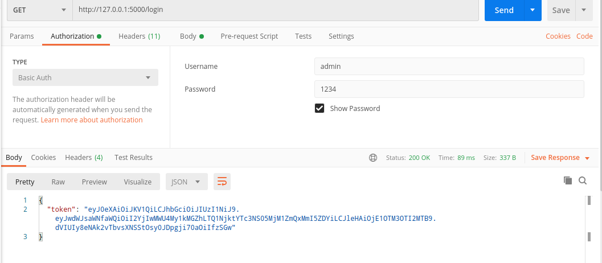
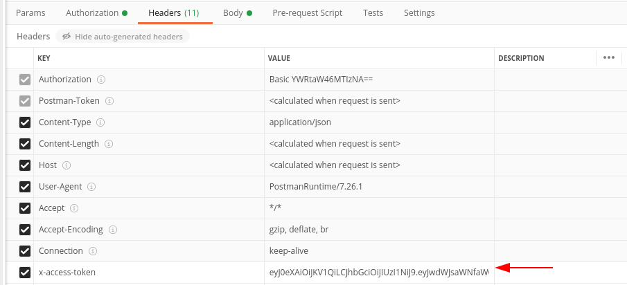

# RESTful Flask

Implementation of a basic product managment RESTful API in Flask, using both HTTP and JSON Web Token validation.

## How to run
Firstly run
  > pip install -r requirements.txt (Python 2), or pip3 install -r requirements.txt (Python 3)

This repo already contains a db but if one wants to create it by himself just delete *db.sqlite*, open a python prompt and write the following:

> from app import db
> 
> db.create_all()

## User authentication
There are already two registered users on the API being ther usernames *user* and *admin*, both with the password *1234*.

The admim user has admin priviledges, which means it can create new users, promote them to admins and delete them.

To login as an user, send a authorization request do the /login route.

This will yield a JSON web token which must be included in the header of the requests in order to validate the user.

## Users

The basic CRUD operations are implemented, these are:
 * Create: create a new user;
 * Read: list all users;
 * Update: promote an user to admin;
 * Delete: delete an user.
 
Only an user with admin permissions is able to perform this tasks

## Products

An admin user will be able to view all products, while a normal user can only see his own products. 

The basic CRUD operations are also implemented:
 * Create: create a new product;
 * Read: list all products or a single product;
 * Update: update a product (quantity, price, ...);
 * Delete: delete a product.

